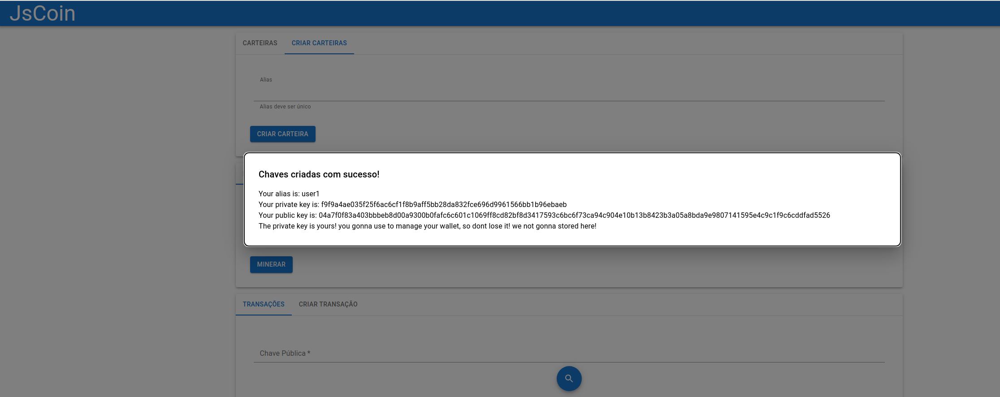
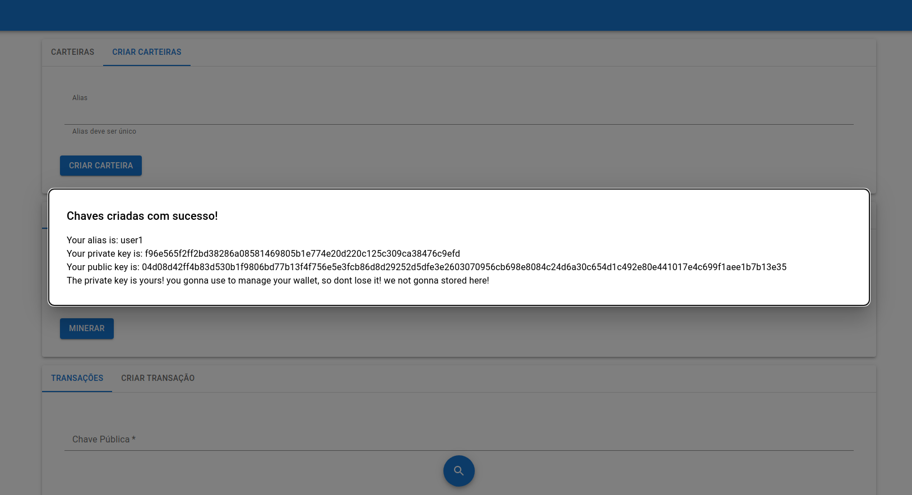
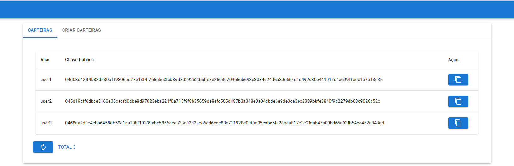
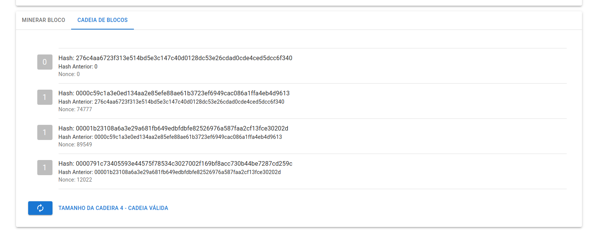
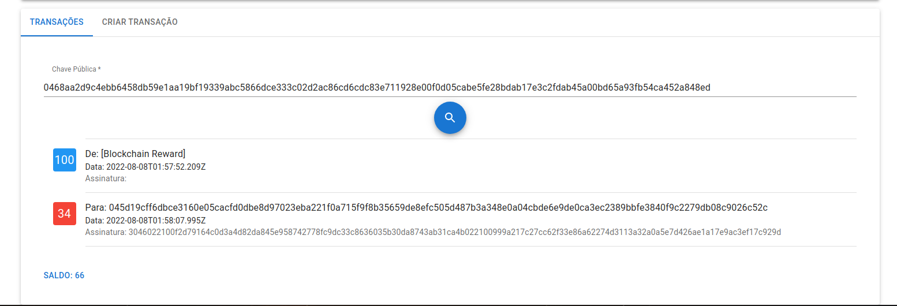

# Blockchain em JavaScript

## Intro

É uma aplicação que simula, do jeito mais básico, como funciona o blockchain e já aplicando como um coin(semelhante ao btc). A ideia desse projeto é estudar e entender o básico de como o blockchain funciona, matar a minha curiosidade e ver como seria esse sistema funcionando.








## Arquitetura

Segui a ideia de dois projetos separados:

* Front - SPA
* Back - Serviço Rest em volta do core(Blockchain)

Utilizando a ideia de componentes na UI junto com o MUI(Material Design for React) e no serviço com Typescript e Express.

### Como executar os projetos

Front - Vai iniciar a interface em localhost:3000
```
npm run start
```

Back - Vai iniciar o seriço em localhost:3001
```
npm run dev
```

## Tools

* Front
    * React & Javascript
* Back
    * Node, Express, Jest & Typescript

## Observações

Utilizei a stack do js para expandir um pouco mais os meus conhecimentos, sendo assim, como não é a minha tecnologia primária não estará com as melhores práticas e padrões.
